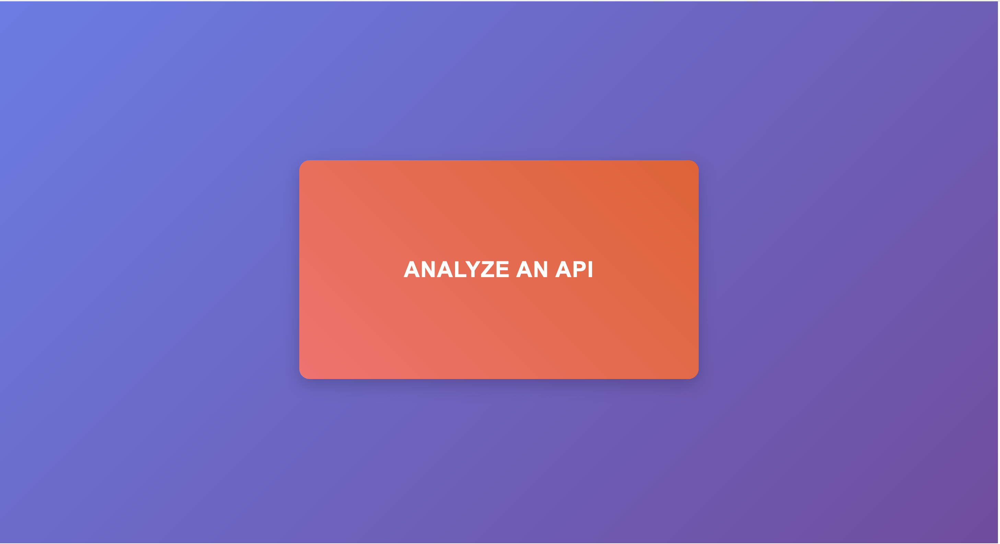
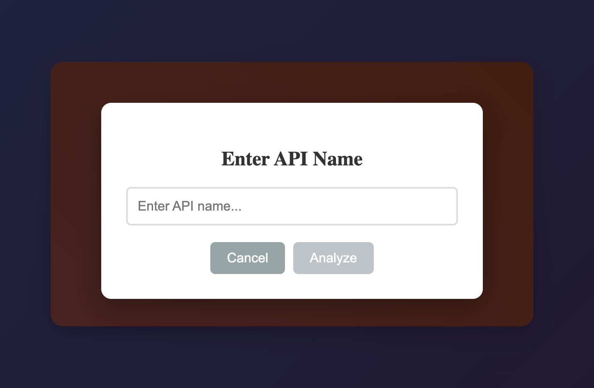
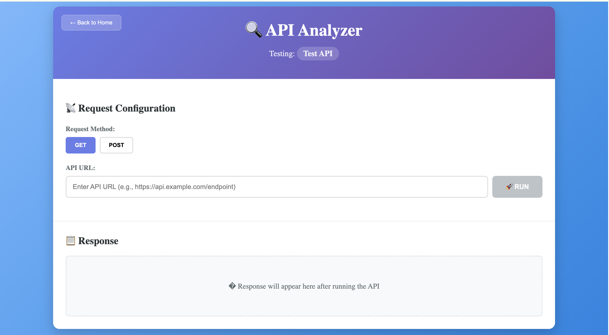

# 🔍 API Tracker & Analyzer

A modern Angular 17 application for testing and analyzing APIs with a Postman-like interface. Built with TypeScript, standalone components, and environment-based configuration.

## ✨ Features

- **🚀 Postman-like Interface**: Clean, intuitive UI for API testing
- **📡 Multiple Request Methods**: Support for GET and POST requests
- **🎯 Real-time Response Analysis**: View status codes, response times, and formatted JSON
- **📝 Error Logging**: Track and log API errors to backend
- **🌍 Environment Configuration**: Separate configs for development and production
- **🔒 Duplicate Prevention**: Smart controls to prevent duplicate error logging
- **📱 Responsive Design**: Works seamlessly across different screen sizes

## 🖼️ User Interface

### 1. Home Page - Landing Screen


The landing page features a clean, centered design with a prominent "ANALYZE AN API" button. Users can click this button to start their API testing journey.

**Key Features:**
- Gradient background for modern look
- Centered button with 40% width/height ratio
- Hover effects and smooth animations

### 2. API Name Input Modal


When users click the "Analyze an API" button, a modal appears requesting the API name for identification and tracking purposes.

**Features:**
- Clean modal design with backdrop overlay
- Input validation (Enter key support)
- Cancel and Analyze action buttons
- Real-time form validation

### 3. API Analyzer - Main Testing Interface


The main testing interface provides a comprehensive API testing environment similar to Postman.

**Components:**

**📡 Request Configuration Panel:**
- Request method selection (GET/POST)
- API URL input field with validation
- Request body editor (for POST requests)
- Prominent RUN button

**📋 Response Viewer:**
- Status code display (color-coded: green for 2xx, red for errors)
- Response time measurement
- Formatted JSON response display
- Smart error logging controls

## 🛠️ Technical Stack

- **Framework**: Angular 17 (Latest)
- **Language**: TypeScript
- **Architecture**: Standalone Components
- **Styling**: CSS3 with custom gradients and animations
- **HTTP Client**: Angular HTTP Client with environment-based URLs
- **Routing**: Angular Router with parameter passing
- **State Management**: Component-based state with service injection

## 🏗️ Project Structure

```
src/
├── app/
│   ├── components/
│   │   ├── home/                 # Landing page component
│   │   └── api-analyzer/         # Main API testing interface
│   ├── services/
│   │   └── api.service.ts        # API communication service
│   ├── environments/
│   │   ├── environment.ts        # Development config
│   │   └── environment.prod.ts   # Production config
│   └── app.routes.ts            # Application routing
├── assets/                      # Static assets
└── styles.css                  # Global styles
```

## 🚀 Quick Start

### Prerequisites

- Node.js 20.x
- Angular CLI 17.x
- npm or yarn

### Installation

1. **Clone the repository**
```bash
git clone <repository-url>
cd angular-app
```

2. **Install dependencies**
```bash
npm install
```

3. **Configure environment**
Update `src/environments/environment.ts` with your API endpoints:
```typescript
export const environment = {
  production: false,
  apiUrl: 'http://localhost:8000/api',
  endpoints: {
    runApi: '/runApi',
    logError: '/logError'
  }
};
```

4. **Start development server**
```bash
npm start
```

5. **Open browser**
Navigate to `http://localhost:4200/`

## 🔧 Available Scripts

| Command | Description |
|---------|-------------|
| `npm start` | Start development server |
| `npm run build` | Build for production |
| `npm test` | Run unit tests |
| `npm run watch` | Build and watch for changes |

## 🌐 Environment Configuration

The application supports multiple environments:

### Development (default)
- API URL: `http://localhost:8000/api`
- Debug logging enabled
- Source maps included

### Production
- API URL: Configurable production endpoint
- Optimized builds
- Error tracking enabled

## 📡 API Integration

The application integrates with a backend API providing these endpoints:

### Run API Request
```
POST /api/runApi
Content-Type: application/json

{
  "apiName": "Sample API",
  "apiUrl": "https://api.example.com/endpoint",
  "apiRequestBody": "{}",
  "apiRequestMethod": "GET"
}
```

### Log Error
```
GET /api/logError
```
Automatically stores the latest API response for error tracking.

## 🎨 Design Features

- **Modern Gradients**: Beautiful color schemes throughout the UI
- **Responsive Layout**: Optimized for desktop and mobile devices
- **Smooth Animations**: Hover effects and transitions
- **Status Indicators**: Color-coded success/error states
- **Loading States**: Visual feedback during API calls

## 🧪 Testing

### Unit Tests
```bash
npm test
```

### E2E Tests
```bash
npm run e2e
```

## 🔄 Development Workflow

1. **Feature Development**: Create feature branches
2. **Component Testing**: Test individual components
3. **Integration Testing**: Verify API communication
4. **UI Testing**: Validate responsive design
5. **Code Review**: Peer review process
6. **Deployment**: Automated CI/CD pipeline

## 📝 Contributing

1. Fork the repository
2. Create a feature branch (`git checkout -b feature/amazing-feature`)
3. Commit your changes (`git commit -m 'Add amazing feature'`)
4. Push to the branch (`git push origin feature/amazing-feature`)
5. Open a Pull Request

## 📄 License

This project is licensed under the MIT License - see the LICENSE file for details.

## 🆘 Support

For support and questions:
- Create an issue in the repository
- Check the documentation
- Review existing issues and discussions

---

**Built with ❤️ using Angular 17 and TypeScript**
